# Stable Diffusion from Scratch

A full-stack implementation of Stable Diffusion trained on LAION-2B-en-aesthetic, built entirely from scratch in PyTorch. The model implements the complete latent diffusion pipeline — from raw image data through VAE encoding, CLIP text conditioning, and a custom UNet denoising model — without relying on any high-level diffusion library.

**Hardware:** 2× RTX 5090 (Blackwell, cc 10.x, 32 GB VRAM each) on RunPod
**Dataset:** LAION-2B-en-aesthetic (~12M images pre-training) + curated fine-tuning subset
**Status:** Training ongoing — 42 epochs, 232K steps, best loss 0.0947 (epoch 16)
**W&B:** [atandrabharati-self/stable-diffusion](https://wandb.ai/atandrabharati-self/stable-diffusion)

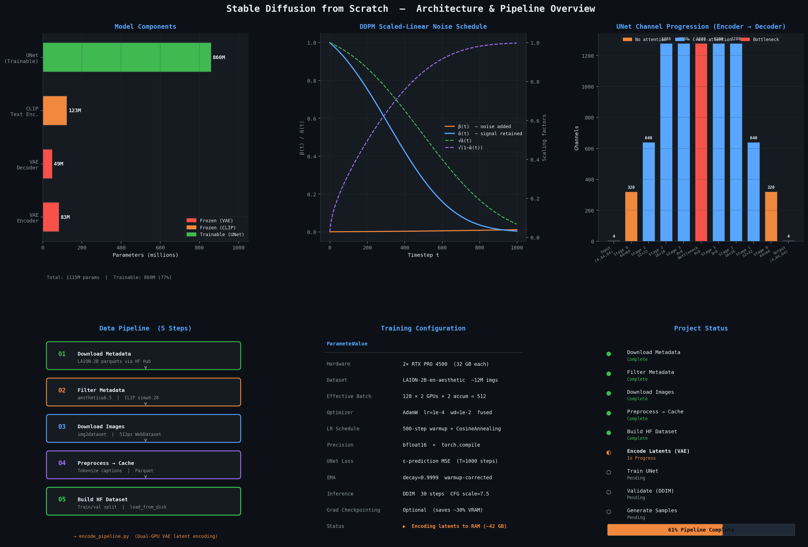

---

## Architecture

```
TEXT PROMPT
    │
    ▼
┌──────────────────────────────────┐
│  CLIP Text Encoder (frozen)      │  openai/clip-vit-large-patch14
│  77 tokens → (B, 77, 768)        │  123M params — no gradient
└──────────────────┬───────────────┘
                   │  context (B, 77, 768)
                   │
IMAGE              │
    │              │
    ▼              │
┌──────────────────────────────────┐
│  VAE Encoder (frozen)            │  stabilityai/sd-vae-ft-mse
│  (B,3,512,512) → (B,4,64,64)     │  83M params — no gradient
└──────────────────┬───────────────┘
                   │  latent z
                   ▼
           ┌───────────────┐
           │  add_noise(z,t)│  DDPM forward: z_t = √ᾱ_t·z + √(1-ᾱ_t)·ε
           └───────┬───────┘
                   │  (B, 4, 64, 64)  noisy latent
                   ▼
┌──────────────────────────────────┐
│  UNet Denoising Model            │  ~860M params — TRAINABLE
│                                  │
│  Encoder:                        │
│    Stage 0 (64×64):  320 ch      │  — no attention
│    Stage 1 (32×32):  640 ch      │  ← SpatialTransformer (cross-attn)
│    Stage 2 (16×16): 1280 ch      │  ← SpatialTransformer (cross-attn)
│    Stage 3  (8×8): 1280 ch       │  ← SpatialTransformer (cross-attn)
│  Bottleneck (8×8): 1280 ch       │  ← attn + resblock
│  Decoder:                        │
│    Stage 3  (8×8): 1280 ch       │  ← SpatialTransformer (cross-attn)
│    Stage 2 (16×16): 1280 ch      │  ← SpatialTransformer (cross-attn)
│    Stage 1 (32×32):  640 ch      │  ← SpatialTransformer (cross-attn)
│    Stage 0 (64×64):  320 ch      │  — no attention
│                                  │
│  ε_θ(z_t, t, ctx) → (B, 4, 64, 64)
└──────────────────┬───────────────┘
                   │  predicted noise ε̂
                   │
            MSE Loss: ||ε̂ − ε||²
                   │
           ┌───────▼───────┐
           │  DDIM Sampler │  inference: 30 steps (vs 1000 DDPM)
           └───────┬───────┘
                   ▼
┌──────────────────────────────────┐
│  VAE Decoder (frozen)            │  (B,4,64,64) → (B,3,512,512)
└──────────────────────────────────┘
                   │
                   ▼
          Generated Image (512×512)
```

---

## Key Design Decisions

| Design Choice | Implementation | Rationale |
|---------------|---------------|-----------|
| **Latent diffusion** | Operate in VAE's 4×64×64 space | 64× cheaper than pixel-space diffusion |
| **Frozen VAE + CLIP** | No gradients, no optimiser state | Reuse strong pretrained representations |
| **Epsilon prediction** | MSE loss on noise ε | Empirically more stable than x₀ or v-prediction |
| **Scaled-linear β schedule** | `β = linspace(√β_start, √β_end)²` | Better image quality than linear for latent diffusion |
| **DDIM inference** | 30 deterministic steps | Same quality as 1000-step DDPM, 33× faster |
| **EMA** | decay=0.9999, warmup-corrected | Smoother weights → better generation quality |
| **Latent pre-encoding** | Encode all images once, cache to RAM | Eliminates VAE from training loop entirely |
| **bfloat16 + torch.compile** | `mode="max-autotune"` on UNet | Best throughput on Blackwell (no GradScaler needed) |
| **DistributedDataParallel** | DDP + NCCL backend, `torchrun` launcher | True process-per-GPU parallelism; faster than DataParallel |
| **Min-SNR loss weighting** | γ=5, weight = min(SNR, γ)/SNR | Balances training signal across easy/hard timesteps |
| **EMA on GPU** | decay=0.9999, maintained on GPU | Eliminates CPU↔GPU copies; warmup-corrected |
| **Classifier-free guidance** | scale=7.5, concat uncond+cond | 2× UNet forward per step; strong prompt adherence |

---

## Loss Function

The UNet is trained with the **epsilon-prediction MSE** objective from DDPM (Ho et al., 2020):

```
L = E_{t, z₀, ε} [ ||ε − ε_θ(√ᾱ_t · z₀ + √(1−ᾱ_t) · ε, t, ctx)||² ]
```

where:
- `z₀` — clean VAE latent, shape `(B, 4, 64, 64)`
- `ε ~ N(0, I)` — sampled Gaussian noise
- `ᾱ_t` — cumulative noise product at timestep `t`
- `ε_θ` — UNet denoiser conditioned on timestep `t` and CLIP context `ctx`

The noisy latent is constructed via the forward diffusion process:
```
z_t = √ᾱ_t · z₀ + √(1−ᾱ_t) · ε
```

---

## DDIM Inference

DDIM (Song et al., 2020) enables deterministic generation in 25–50 forward passes instead of 1000. The denoising update at each step:

```
x̂₀   = (x_t − √(1−ᾱ_t) · ε_θ) / √ᾱ_t        # predict clean latent
x_{t−1} = √ᾱ_{t−1} · x̂₀ + √(1−ᾱ_{t−1}) · ε_θ  # deterministic step (η=0)
```

Classifier-free guidance combines conditional and unconditional predictions:
```
ε_guided = ε_uncond + s · (ε_cond − ε_uncond)     # s = guidance_scale = 7.5
```

---

## UNet Implementation

### ResNet Block with Timestep Conditioning
```python
class ResNetBlock(nn.Module):
    def __init__(self, in_ch, out_ch, t_dim):
        # Time embedding projected into channel space (FiLM conditioning)
        self.t_proj = nn.Linear(t_dim, out_ch)

    def _forward(self, x, t_emb):
        h = self.conv1(self.act(self.norm1(x)))
        h = h + self.t_proj(self.act(t_emb))[:, :, None, None]  # broadcast
        h = self.conv2(self.act(self.norm2(h)))
        return h + self.skip(x)
```

### Cross-Attention for Text Conditioning
```python
class CrossAttention(nn.Module):
    # Q from image features, K/V from CLIP text embeddings
    def forward(self, x, ctx):
        q = self.to_q(x)
        k, v = self.to_k(ctx), self.to_v(ctx)
        # Scaled dot-product attention (Flash Attention via SDPA)
        out = F.scaled_dot_product_attention(q, k, v)
        return self.proj(out)
```

### Zero-Init Output Projection
All final output projections (UNet `conv_out`, `TransformerBlock` output) are zero-initialized:
```python
nn.init.zeros_(self.conv_out.weight)
nn.init.zeros_(self.conv_out.bias)
```
This ensures the network starts by predicting zero noise — a stable initialization that prevents early training collapse.

### Gradient Checkpointing (Optional)
```python
# Enable with --grad_ckpt flag to save ~30% VRAM
model.enable_gradient_checkpointing()
```
Each `UNetResBlock` uses `torch.utils.checkpoint` with `use_reentrant=False`.

---

## Data Pipeline

The full 5-step pipeline produces a ready-to-train HuggingFace dataset from raw LAION metadata:

```
Pre-training data (LAION-2B-en-aesthetic, ~12M images):
  Step 1: 01_download_metadata.py    LAION-2B-en-aesthetic parquets via HF Hub
             ↓
  Step 2: 02_filter_metadata.py      Quality filters (aesthetic ≥ 6.5, CLIP sim ≥ 0.28,
             ↓                       resolution ≥ 512px, no watermarks/NSFW) → ~12M images
  Step 3: 03_download_images.py      img2dataset: parallel download + WebDataset shards
             ↓                       16 processes × 64 threads, incremental resume
  Step 4: 04_preprocess_to_cache.py  Extract image_key + CLIP-tokenized captions
             ↓                       (images stay in .tar shards — not duplicated)
  Step 5: 05_build_hf_dataset.py     Merge batches → HuggingFace Dataset
                                     train/val split, shuffle, save_to_disk

Fine-tuning data (DiffusionDB + JourneyDB high-quality subset):
  Step 1b: 01b_download_diffusiondb.py      DiffusionDB: 500 shards, ~2M Stable Diffusion images
  Step 1c: 01c_download_journeydb_images.py JourneyDB: 10 archives, ~210K Midjourney images
             ↓                              Both converted to WebDataset tar format at 512px
             → same Steps 2–5 as above (filter, preprocess, build HF dataset)
```

### Filtering Criteria (Step 2)

| Filter | Threshold | Reason |
|--------|-----------|--------|
| `aesthetic_score` | ≥ 6.5 | Top ~2% of LAION-2B — high visual quality |
| `clip_similarity` | ≥ 0.28 | Caption must describe the image content |
| `width`, `height` | ≥ 512px | No upscaling — prevents blurry training signal |
| Aspect ratio | 0.5 – 2.0 | Avoid extreme crops of portraits/panoramas |
| Caption length | 20–300 chars | Informative but not CLIP-truncated |
| `pwatermark` | < 0.5 | Prevents model from generating watermarks |
| NSFW | `UNLIKELY` only | Clean training distribution |

---

## Latent Pre-Encoding

`src/encode_pipeline.py` uses **process isolation** for true dual-GPU parallelism:

```python
# Each process gets exclusive access to one physical GPU
os.environ["CUDA_VISIBLE_DEVICES"] = str(gpu_physical_id)

# After import, 'cuda:0' maps to the assigned physical GPU
device = torch.device("cuda:0")
```

This avoids CUDA context sharing between processes and achieves near-linear GPU utilization scaling. The VAE encodes images in batches of 32, saving `(4, 64, 64)` float16 tensors as `.npy` files.

At training time, `load_latent_cache()` loads all ~12M latent tensors into RAM in parallel using 16 threads, eliminating all disk I/O from the training loop.

---

## Training

### Training History

| | Phase 1 — Pre-training | Phase 2a — LAION Fine-tuning | Phase 2b — DiffusionDB/JourneyDB | Phase 2c — Extended FT |
|---|---|---|---|---|
| **Epochs** | 1 – 10 | 11 – 17 | 18 – 21 | 22 – 42 |
| **Steps** | 0 – 136K | 136K – 152K | 152K – 181K | 181K – 232K |
| **Dataset** | LAION-2B-en-aesthetic (~12M images) | 212K filtered LAION subset | 705K DiffusionDB + JourneyDB | Filtered FT dataset |
| **LR** | 1e-4 → 1e-5 | 3e-6 | 3e-6 → 8e-6 | 2e-6 → 1e-6 |
| **End loss** | 0.1247 | **0.0947 (best)** | 0.1030 | 0.1212 |
| **Min-SNR γ** | 5 | 5 | 5 → 3.0 | 2 – 5 |
| **cfg_dropout** | 0 → 0.05 | 0.05 | 0.05 – 0.10 | 0.05 |

**Recommended checkpoint: `sd_epoch_017.pt`** (step 151,836, loss 0.0947).

Epochs 18–21 fine-tuned on 705K DiffusionDB/JourneyDB images. LR was raised to 8e-6 in epochs 19–21 which proved too aggressive — **mode collapse** caused the model to output faces for all prompts. Epoch 17 is the clean working baseline.

Phase 2c (epochs 22–42) resumes from epoch 17 with lr=2e-6, warmup 1000 steps, and a filtered dataset with 223K face/human prompts removed via `06_filter_dataset.py`. Training is ongoing.

Full loss curve data (3,493 points): [`results/loss_curve.csv`](results/loss_curve.csv)
Full training log: [`results/training_status.md`](results/training_status.md)

### Quickstart (RunPod)

```bash
# 1. Clone and install
git clone https://github.com/atandra2000/StableDiffusion
cd StableDiffusion
pip install -r requirements.txt

# 2. Run data pipeline (Steps 01–06)
python data_pipeline/01_download_metadata.py
python data_pipeline/02_filter_metadata.py
python data_pipeline/03_download_images.py
python data_pipeline/04_preprocess_to_cache.py
python data_pipeline/05_build_hf_dataset.py
python data_pipeline/06_filter_dataset.py   # optional: for FT filtered set

# 3. Encode latents to disk (dual-GPU)
python src/encode_pipeline.py

# 4. Train with DDP (2× RTX 5090)
torchrun --nproc_per_node=2 src/SD_Train.py \
    --cache_path /workspace/StableDiffusion/laion_hf_dataset \
    --latent_dir /workspace/StableDiffusion/laion_latents \
    --epochs 30 \
    --batch_size 24 \
    --grad_accum 2 \
    --lr 1e-4 \
    --use_wandb

# 5. Generate images (CUDA)
python src/SD_ImageGen.py \
    --checkpoint checkpoints/sd_latest.pt \
    --prompts "a photorealistic sunset over mountain peaks" \
    --steps 50 --guidance 7.5 --seed 42 --output output.png
```

### Resume Training

```bash
torchrun --nproc_per_node=2 src/train.py \
    --cache_path /workspace/StableDiffusion/laion_hf_dataset \
    --latent_dir /workspace/StableDiffusion/laion_latents \
    --resume /workspace/checkpoints/sd_latest.pt
```

### Mid-Epoch Checkpointing (for interruptible pods)

```bash
torchrun --nproc_per_node=2 src/train.py \
    --cache_path /workspace/StableDiffusion/hf_dataset_filtered/train \
    --latent_dir /workspace/StableDiffusion/latents_filtered/latents \
    --epochs      22 \
    --batch_size  24 \
    --grad_accum  2 \
    --lr          2e-6 \
    --warmup_steps 1000 \
    --cfg_dropout  0.05 \
    --min_snr \
    --min_snr_gamma 5.0 \
    --grad_ckpt \
    --save_steps  1000 \
    --ckpt_dir    /workspace/StableDiffusion/phase1_v2_checkpoints \
    --resume      /workspace/StableDiffusion/checkpoints/sd_epoch_017.pt \
    --use_wandb
```

`--save_steps 1000` saves `sd_step_XXXXXXX.pt` + overwrites `sd_latest.pt` every 1000 global steps. If the pod is killed, resume from `sd_latest.pt` to continue mid-epoch from the last save point.

### Generate with Trained Checkpoint

```python
import torch
from src.model import StableDiffusionModel, PretrainedVAE, PretrainedCLIPTextEncoder
from src.model import UNetModel, DDPMScheduler, DDIMScheduler
from transformers import CLIPTokenizer

# Load model
vae      = PretrainedVAE("stabilityai/sd-vae-ft-mse").cuda()
clip     = PretrainedCLIPTextEncoder("openai/clip-vit-large-patch14").cuda()
unet     = UNetModel(in_ch=4, out_ch=4, ch=320, res_blks=2,
                     attn_lvls=(1,2,3), ch_mults=(1,2,4,4), heads=8,
                     t_dim=320, ctx_dim=768).cuda()

ckpt = torch.load("checkpoints/sd_latest.pt")
unet.load_state_dict(ckpt["unet_state_dict"])

# Tokenize
tokenizer = CLIPTokenizer.from_pretrained("openai/clip-vit-large-patch14")
prompt = "a photorealistic sunset over mountain peaks"
tokens = tokenizer(prompt, padding="max_length", max_length=77,
                   truncation=True, return_tensors="pt").to("cuda")

# Generate (DDIM, 30 steps, CFG=7.5)
sched = DDIMScheduler()
sched.set_timesteps(30, device="cuda")
latents = torch.randn(1, 4, 64, 64, device="cuda")
ctx = clip(tokens.input_ids, tokens.attention_mask)[0].unsqueeze(0)
uncond = clip(tokenizer([""], ...)[0])[0].unsqueeze(0)

for t in sched.timesteps:
    noise_pred = unet(torch.cat([latents]*2), t.expand(2), torch.cat([uncond, ctx]))
    noise_uncond, noise_cond = noise_pred.chunk(2)
    guided = noise_uncond + 7.5 * (noise_cond - noise_uncond)
    latents = sched.step(guided, t, latents)

image = vae.decode(latents)   # (1, 3, 512, 512) in [-1, 1]
```

---

## Hyperparameter Reference

| Parameter | Value | Notes |
|-----------|-------|-------|
| Image resolution | 512 × 512 | Native SD resolution |
| Latent resolution | 64 × 64 | 8× downsampled by VAE |
| Latent channels | 4 | VAE bottleneck |
| UNet base channels | 320 | SD 1.x standard |
| Channel multipliers | (1, 2, 4, 4) | → 320, 640, 1280, 1280 |
| ResBlocks per stage | 2 | Encoder and decoder |
| Attention heads | 8 | In all SpatialTransformers |
| Context dimension | 768 | CLIP ViT-L/14 output |
| DDPM timesteps | 1000 | Training schedule |
| β start / end | 0.00085 / 0.012 | Scaled-linear schedule |
| β schedule | `scaled_linear` | Better than linear for latents |
| DDIM steps | 30 | Inference |
| Guidance scale | 7.5 | Classifier-free guidance |
| Optimizer | AdamW | fused=True for throughput |
| Learning rate | 1e-4 | |
| Weight decay | 1e-2 | |
| LR warmup | 500 steps | Linear 1e-6 → 1e-4 |
| LR decay | CosineAnnealing | eta_min = lr × 1e-2 |
| Batch size (effective) | 96 | 24/GPU × 2 GPUs × 2 accum |
| EMA decay | 0.9999 | Warmup-corrected, maintained on GPU |
| Precision | bfloat16 | Blackwell native (no GradScaler) |
| Compilation | `torch.compile` | `max-autotune` mode |
| Min-SNR γ | 5 → 2.5 (pretrain) / 2–5 (FT) | Loss weighting by Hang et al. (2023) |
| cfg_dropout | 0.05–0.10 (FT phase) | Random caption drop for CFG training |
| Total steps | 232,235 | Pre-train 136K + Fine-tune 96K (ongoing) |
| Best loss | 0.0947 | Epoch 16, step 149,718 |
| Grad norm clip | 1.0 | Prevents gradient explosion |

---

## Repository Structure

```
StableDiffusion/
├── src/
│   ├── SD_Model.py           # Production model: VAE (fp16), CLIP, UNet, DDPM/DDIM schedulers
│   ├── SD_Model_v2.py        # Next-gen MM-DiT + dual CLIP + Rectified Flow (SD3-style)
│   ├── SD_Model_scratch.py   # Educational scratch implementation
│   ├── SD_Train.py           # DDP training loop for 2× RTX 5090, Min-SNR, EMA, BF16
│   ├── SD_Train_v2.py        # MM-DiT training (velocity prediction, logit-normal timesteps)
│   ├── SD_ImageGen.py        # GPU inference: DDIM + CFG, negative prompts, grid output
│   ├── model.py              # Core model (earlier iteration)
│   ├── train.py              # Earlier training loop
│   ├── generate.py           # GPU inference CLI
│   ├── inference.py          # Apple Silicon / MPS inference (local generation)
│   ├── encode_pipeline.py    # Dual-GPU VAE latent encoding
│   └── encode_latents.py     # 3-stage pipeline encoder: shard prefetch + DMA + bfloat16
├── data_pipeline/
│   ├── 01_download_metadata.py         # Download LAION-2B-en-aesthetic parquets
│   ├── 01b_download_diffusiondb.py     # Download DiffusionDB (FT dataset)
│   ├── 01c_download_journeydb_images.py # Download JourneyDB subset (FT dataset)
│   ├── 02_filter_metadata.py           # Quality filtering (aesthetic, CLIP, resolution)
│   ├── 03_build_hf_dataset.py          # Hybrid HF Dataset build from parquet batches
│   ├── 03_download_images.py           # img2dataset parallel image download
│   ├── 04_preprocess_to_cache.py       # Tokenize captions, build hybrid cache
│   ├── 05_build_hf_dataset.py          # Merge into HuggingFace Dataset (train/val split)
│   └── 06_filter_dataset.py            # Remove celebrities/NSFW; hardlink filtered latents
├── configs/
│   └── config.py             # All hyperparameters in typed dataclasses
├── assets/
│   ├── generate_plots.py     # Architecture overview chart
│   └── architecture_overview.png
├── results/
│   ├── training_status.md    # Full training log: pre-training + fine-tuning (ep 1–42)
│   ├── loss_curve.csv        # 3,493-point loss history across 232K steps
│   └── samples/              # Generated images from various checkpoints
│       ├── car.png, city.png, city_42.png, forest.png, forest_42.png
│       ├── fullbody.png, fullbody_2.png, fullbody_42.png
│       ├── landscape.png, landscape_42.png
│       ├── man.png, portrait.png, portrait_42.png
│       ├── portrait_centered.png, portrait_centered_2.png, portrait_centered_3.png
│       └── portrait_highcfg.png, cinematic.png, custom.png
├── .github/workflows/
│   └── ci.yml                # Lint + UNet forward pass smoke test
└── requirements.txt
```

---

## Generated Samples

Generated locally on **Apple Silicon (MPS)** using `src/inference.py` from the **epoch 17 checkpoint** (`sd_epoch_017.pt`, step 151,836, best loss 0.0947). DDIM 100 steps, CFG=7.5, seed=42. Load time ~95–106s, generation ~113–120s (1.1–1.2s/step on MPS).

```bash
python3 src/inference.py \
    --checkpoint sd_epoch_017.pt \
    --prompt "a racing car cruising through forest roads" \
    --steps 100 --guidance 7.5 --seed 42 --output results/samples/custom.png

python3 src/inference.py \
    --checkpoint sd_epoch_017.pt \
    --prompt "a man very happy lying down on the beach, cinematic and photorealistic" \
    --steps 100 --guidance 7.5 --seed 42 --output results/samples/cinematic.png

python3 src/inference.py \
    --checkpoint sd_epoch_017.pt \
    --prompt "a man climbing mountain" \
    --steps 100 --guidance 7.5 --seed 42 --output results/samples/man.png
```

| Image | Prompt | Checkpoint |
|-------|--------|------------|
| 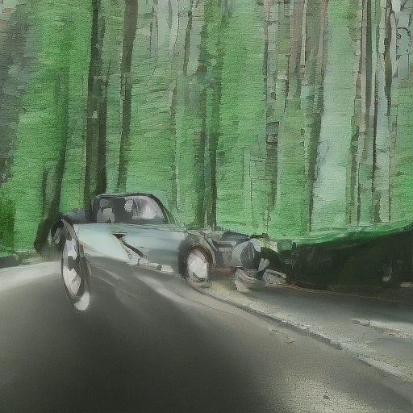 | "a racing car cruising through forest roads" | ep 17 |
| 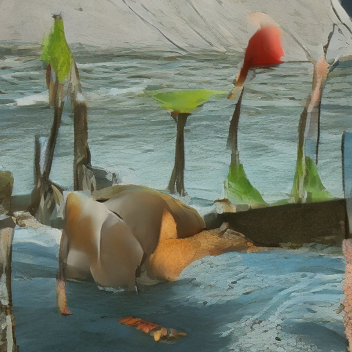 | "a man very happy lying down on the beach, cinematic and photorealistic" | ep 17 |
| 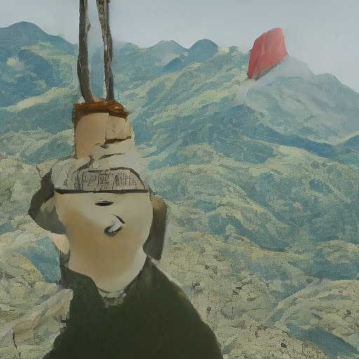 | "a man climbing mountain" | ep 17 |
| 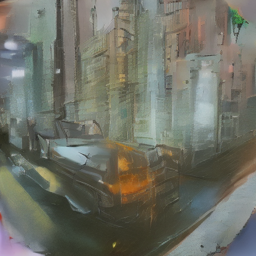 | city | ep 17 |
| 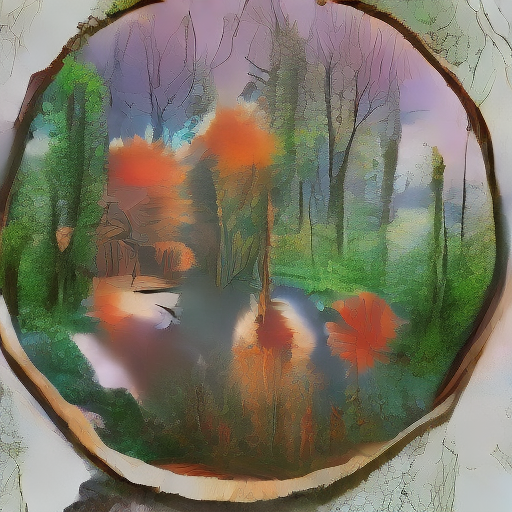 | forest | ep 17 |
| 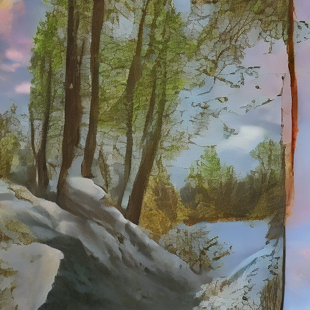 | landscape | ep 17 |
| 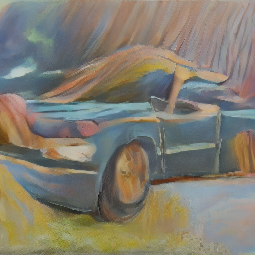 | portrait | ep 17 |
| 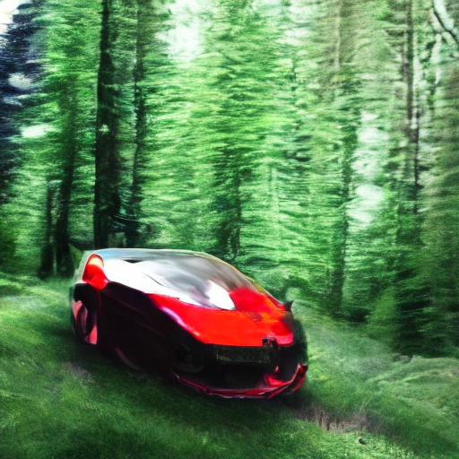 | "a racing car cruising through forest roads" | ep 42 |
|  | portrait (high CFG) | ep 42 |
|  | portrait centered | ep 42 |
| 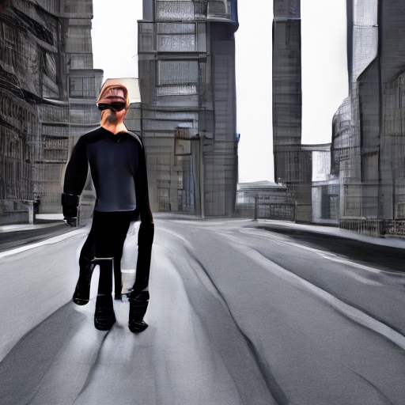 | full body portrait | ep 42 |
| 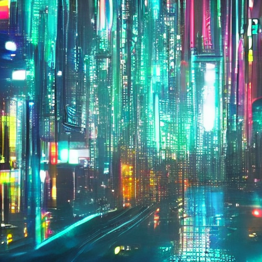 | city | ep 42 |
| 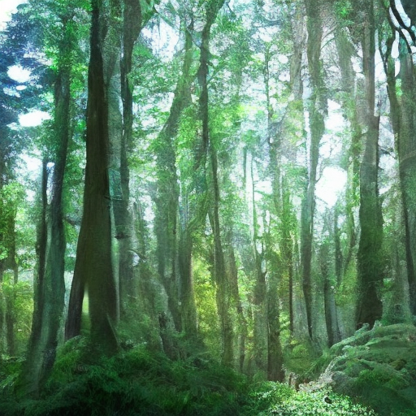 | forest | ep 42 |
| 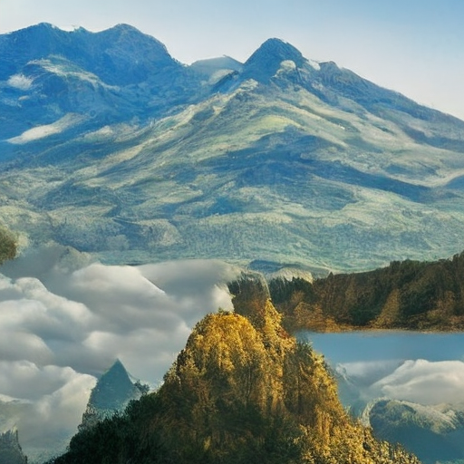 | landscape | ep 42 |

---

## Checkpoints

Checkpoints are stored on Google Drive (~11.6 GB each):

| Epoch | Phase | Global Step | Loss | Notes | Drive |
|-------|-------|-------------|------|-------|-------|
| 10 | Pre-training end | 136,279 | 0.1247 | | [Drive folder](https://drive.google.com/drive/folders/1EJdiLwaE6iMGksj9mr_CZkUF7RlXO9Wp) |
| 14 | LAION fine-tuning | 145,282 | 0.1257 | | [Drive folder](https://drive.google.com/drive/folders/1EJdiLwaE6iMGksj9mr_CZkUF7RlXO9Wp) |
| **17** | **LAION fine-tuning** | **151,818** | **0.0947** | **✅ Recommended for inference** | [Drive folder](https://drive.google.com/drive/folders/1EJdiLwaE6iMGksj9mr_CZkUF7RlXO9Wp) |
| 21 | DiffusionDB/JourneyDB | 181,177 | 0.1030 | ⚠️ Mode collapse — avoid for inference | [Drive folder](https://drive.google.com/drive/folders/1EJdiLwaE6iMGksj9mr_CZkUF7RlXO9Wp) |
| 42 | Extended fine-tuning | 232,235 | 0.1212 | Phase 2c — filtered dataset | [Drive folder](https://drive.google.com/drive/folders/1EJdiLwaE6iMGksj9mr_CZkUF7RlXO9Wp) |

Each checkpoint contains: `unet_state_dict`, `ema_state_dict`, `optimizer_state_dict`, `scheduler_state_dict`, `epoch`, `global_step`, `best_loss`.

---

## References

- **LDM**: Rombach et al. (2022). *High-Resolution Image Synthesis with Latent Diffusion Models*. CVPR.
- **DDPM**: Ho et al. (2020). *Denoising Diffusion Probabilistic Models*. NeurIPS.
- **DDIM**: Song et al. (2020). *Denoising Diffusion Implicit Models*. ICLR.
- **CFG**: Ho & Salimans (2021). *Classifier-Free Diffusion Guidance*.
- **CLIP**: Radford et al. (2021). *Learning Transferable Visual Models from Natural Language Supervision*. ICML.
- **LAION**: Schuhmann et al. (2022). *LAION-5B: An Open Large-Scale Dataset for Training Next Generation Image-Text Models*. NeurIPS.
- **Min-SNR**: Hang et al. (2023). *Efficient Diffusion Training via Min-SNR Weighting Strategy*. ICCV.
