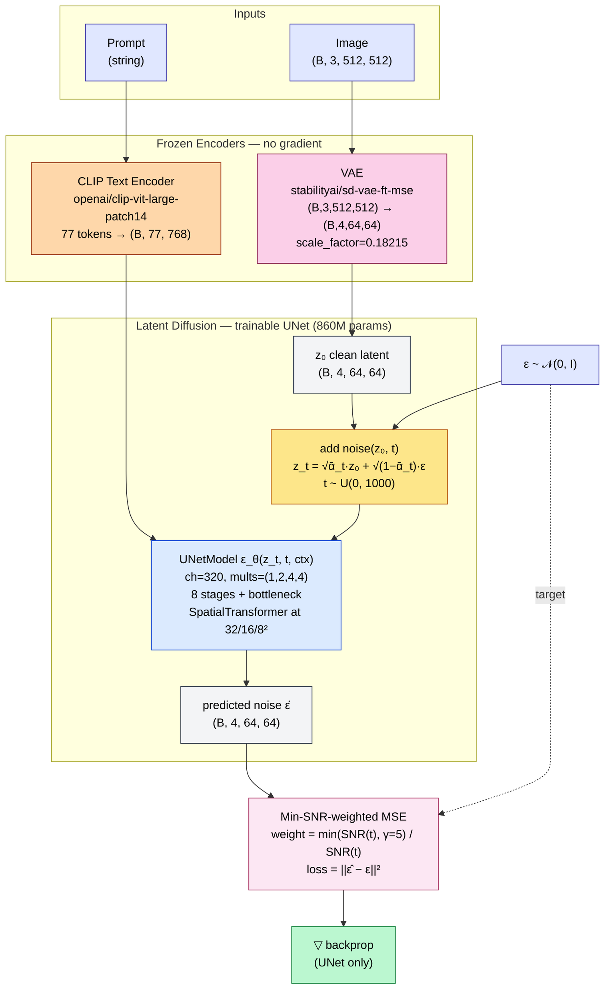
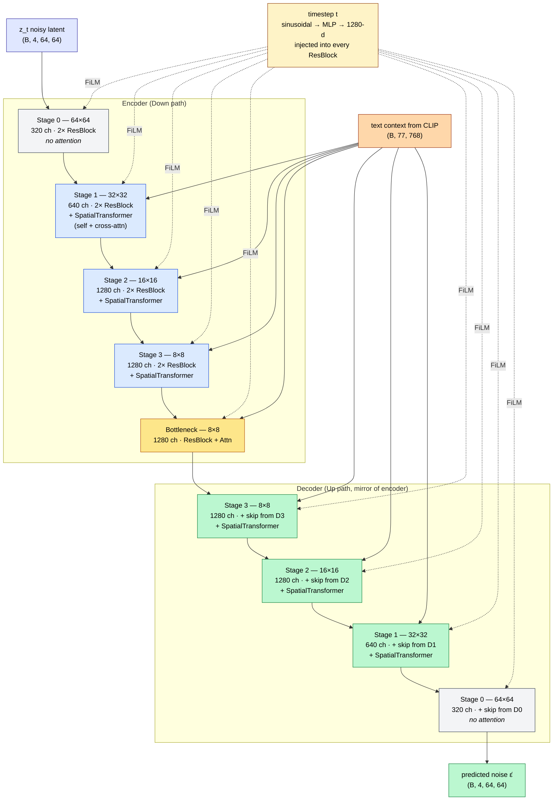
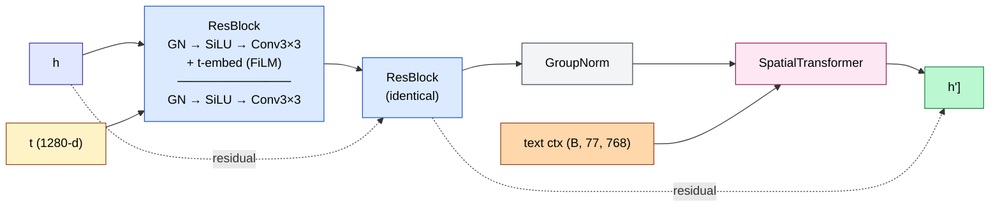
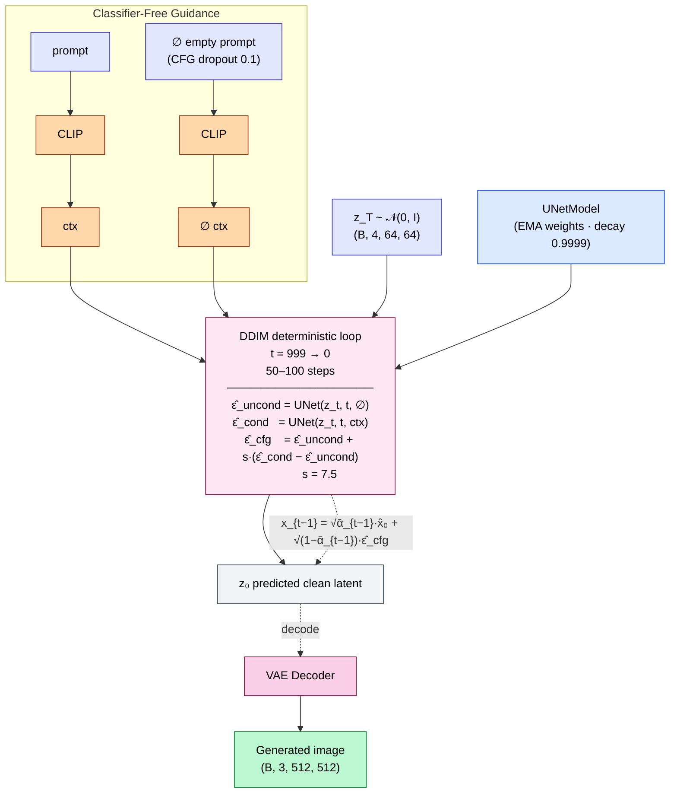
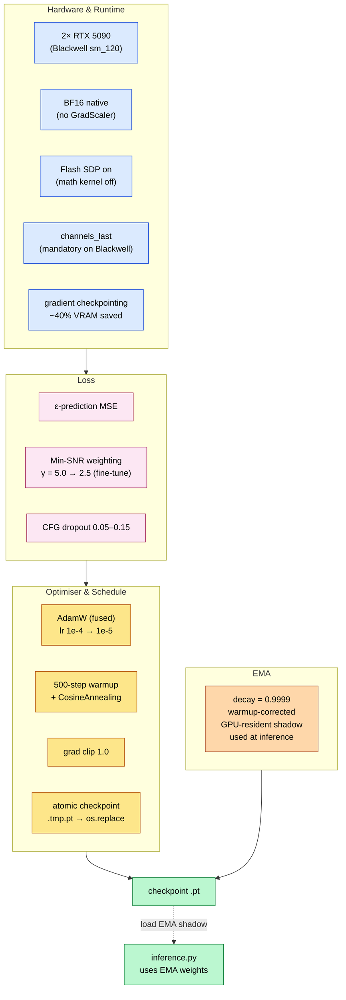

<p align="center">
  
  <em>Sample outputs at epoch 42 — 232K steps on 2× RTX 5090</em>
</p>

# Stable Diffusion from Scratch

[](https://github.com/atandra2000/StableDiffusion)
[](https://huggingface.co/atandra2000/sd-from-scratch-v1)
[](LICENSE)
[](https://www.python.org/)
[](https://wandb.ai/atandrabharati-self/stable-diffusion)

A full-stack Stable Diffusion 1.x-class latent diffusion model — **built entirely from scratch in PyTorch, trained on 2× RTX 5090 (Blackwell) GPUs.** Every component (UNet, DDPM/DDIM, VAE pipeline, CLIP conditioning, data pipeline, DDP training loop) is hand-implemented; no `diffusers`, no `compel`, no black boxes.

**Checkpoint** → [atandra2000/sd-from-scratch-v1](https://huggingface.co/atandra2000/sd-from-scratch-v1) (12.5 GB, sd_epoch_042.pt)

---

## Quick Start

```bash
# 1. Download the checkpoint
pip install huggingface_hub
python scripts/download_checkpoint.py

# 2. Run inference
pip install torch torchvision transformers Pillow
python src/inference.py --prompt "a cinematic shot of a mountain lake at sunset" --checkpoint checkpoints/sd_epoch_042.pt
```

See [docs/inference.md](docs/inference.md) for advanced usage (negative prompts, batch mode, DDIM parameters).

---

## Repository Layout

```
├── src/                      # Core implementation
│   ├── model.py              # UNet (~860M params), DDPM/DDIM schedulers
│   ├── train.py              # DDP + BF16 training loop
│   ├── inference.py          # Apple Silicon + CUDA inference
│   ├── encode_latents.py     # VAE pre-encoding for training
│   ├── encode_pipeline.py    # Data-parallel latent encoder (2-GPU)
│   ├── generate.py           # Programmatic generation API
│   ├── SD_ImageGen.py        # Alternative inference script (CLI)
│   ├── SD_Model.py           # Legacy model (kept for reproducibility)
│   └── SD_Train.py / SD_Train_v2.py  # Legacy training scripts
├── data_pipeline/            # LAION-2B data processing
│   ├── 01_download_metadata.py → 06_filter_dataset.py
├── configs/
│   └── config.py             # Dataclass-based configuration
├── tests/                    # CPU smoke tests
│   ├── test_unet_forward.py
│   └── test_ddim_step.py
├── docs/                     # Documentation
│   ├── architecture.md       # Model architecture deep-dive
│   ├── training-loop.md      # Training procedure
│   ├── data-pipeline.md      # Data pipeline walkthrough
│   ├── inference.md          # Inference guide
│   ├── blog_post.md          # Medium-style write-up
│   └── images/               # Diagrams and samples
├── scripts/
│   └── download_checkpoint.py
├── results/samples/          # Curated output samples
├── assets/                   # Architecture diagram, plots
├── requirements.txt
├── LICENSE                   # MIT
├── CITATION.cff              # Citation metadata
└── .env.example              # Environment variable template
```

---

## Architecture

### System Overview



> **Frozen vs Trainable:** CLIP (123M) and VAE (83M) are frozen; only the UNet (~860M, ~80% of total parameters) receives gradient. The loss targets the predicted noise ε̂ against the sampled noise ε.

---

### UNet (860M params) — the trainable component



> **Skip connections:** every encoder stage's output is concatenated with the corresponding decoder stage's input (U-Net). The U-shape is the whole point — high-resolution features from the encoder flow directly to the decoder for pixel-accurate reconstruction.
>
> **Why Stage 0 has no attention:** at 64×64 spatial, self-attention is O(N²) on 4096 tokens = 16M attention scores per head. The first stage skips it and lets the convolutions do feature extraction at high spatial resolution; attention kicks in at 32×32 and below where the token count drops to 1024 / 256 / 64.

### UNet Block internals — what each stage contains



> **SpatialTransformer = GroupNorm → Conv 1×1 (proj) → LayerNorm → multi-head self-attention → LayerNorm → cross-attention (text as K,V) → LayerNorm → FFN → residual.** Two of these blocks stack per stage (except Stage 0, which skips them entirely). Cross-attention is the only place the CLIP text embedding enters the UNet.

---

### Inference — DDIM 50–100 steps with CFG



> **EMA weights are used for inference** (not the live training weights). EMA shadow decays at 0.9999 with warmup correction and produces visibly cleaner samples.
>
> **CFG scale s=7.5** is the standard SD-1.x default. Lower values (3–5) give more creative/diverse outputs; higher values (10–15) over-condition on the prompt at the cost of diversity.
>
> **Use `inference.py` not `SD_ImageGen.py`.** The legacy `SD_ImageGen.py` clamps `pred_x0` to `[-1, 1]` — correct for *pixels* but destructive for *latents* (which have std ≈ 4). `inference.py` skips the clamp.

---

### Training Stack (DDP / BF16 / FA2 / EMA / Min-SNR)



> **Zero-init on every output projection** — `nn.init.zeros_` on `nn.Conv2d` and `nn.Linear` outputs. The model starts as the identity `ε̂ = z_t` and learns the residual. Removing this causes early-training divergence.
>
> **DDP NCCL over BF16** with `torch.backends.cuda.enable_flash_sdp(True)` and `model.to(memory_format=torch.channels_last)` is the canonical recipe for Blackwell. No `torch.cuda.amp.GradScaler` — BF16 has the exponent range to skip it.


---

For a detailed architectural walkthrough, see [docs/architecture.md](docs/architecture.md).
, see [docs/architecture.md](docs/architecture.md).

---

## Training Summary

| Stage | Epochs | Steps | Best Loss | LR | Notes |
|-------|--------|-------|-----------|----|-------|
| **Pre-training** | 1–10 | 136K | **0.1247** | 1e-4 → 1e-5 | Cosine decay, Min-SNR γ=5→2.5 |
| **Fine-tuning** | 11–42 | 96K | **0.0947** (ep 16) | 1e-5 | EMA decay=0.9999, CFG dropout=0.05 |
| **Final** | 42 | 232K | 0.1212 | — | Released checkpoint |

- **Hardware:** 2× RTX 5090 (Blackwell, cc 10.x, 32 GB VRAM each) on RunPod
- **Dataset:** LAION-2B-en-aesthetic (~12M images, filtered to aesthetic ≥ 6.5)
- **Multi-GPU:** DDP (NCCL) with BF16 autocast, gradient accumulation (effective batch 96)
- **Loss:** Min-SNR-weighted MSE (γ=5.0 → 2.5 for fine-tuning)
- **EMA:** Polyak decay 0.9999, shadow weights stored in checkpoint

Full loss curves and per-epoch breakdown: [summary.md](summary.md)

---

## Checkpoints

| Download source | Size | Format | Notes |
|---|---|---|---|
| [Hugging Face Hub](https://huggingface.co/atandra2000/sd-from-scratch-v1) | 12.5 GB | PyTorch `.pt` | Contains `ema_state_dict` + `unet_state_dict`, optimizer, LR scheduler |
| GitHub Releases | — | — | Coming in v1.1 |

### Loading from Python

```python
import sys, torch
sys.path.insert(0, "src")              # make src/ importable

from huggingface_hub import hf_hub_download
from SD_Model import UNetModel        # legacy single-file module
# — or, equivalently, the refactored module: from model import UNetModel

checkpoint = hf_hub_download(
    repo_id="atandra2000/sd-from-scratch-v1",
    filename="sd_epoch_042.pt",
    local_dir="checkpoints",
)
ckpt = torch.load(checkpoint, map_location="cpu", weights_only=False)

# Load EMA shadow (produces better images than live weights)
unet = UNetModel(in_ch=4, out_ch=4, ch=320, res_blks=2,
                 attn_lvls=(1, 2, 3), ch_mults=(1, 2, 4, 4),
                 heads=8, ctx_dim=768)
shadow = ckpt["ema_state_dict"]["shadow"]
cleaned = {}
for k, v in shadow.items():
    for prefix in ("module.", "unet.", "_orig_mod."):
        if k.startswith(prefix):
            k = k[len(prefix):]
            break
    cleaned[k] = v
unet.load_state_dict(cleaned, strict=False)   # strict=False: a few shadow keys may be absent
unet.eval()
```

See `src/inference.py:load_ema_unet()` for the canonical loader used in production.

---

## Training Reproduction

### Data Pipeline

```bash
# The full pipeline from raw LAION metadata → encoded latents:
python data_pipeline/01_download_metadata.py
python data_pipeline/02_filter_metadata.py           # aesthetic ≥ 6.5
python data_pipeline/03_download_images.py            # WebDataset shards
python data_pipeline/04_preprocess_to_cache.py        # tokenize + augment
python data_pipeline/05_build_hf_dataset.py           # HuggingFace Dataset
python src/encode_latents.py                          # VAE encode to .npy
python src/encode_pipeline.py                         # 2-GPU parallel encode
```

See [docs/data-pipeline.md](docs/data-pipeline.md) for the complete walkthrough.

### Training

```bash
# Single node, 2× GPU (torchrun)
torchrun --nproc_per_node=2 src/train.py \
  --cache_path laion_hf_dataset/train \
  --latent_dir laion_latents \
  --epochs 42 \
  --batch_size 24 \
  --lr 1e-5 \
  --min_snr --min_snr_gamma 5.0 \
  --cfg_dropout 0.05 \
  --grad_ckpt \
  --memory_format channels_last

# Resume from checkpoint
torchrun --nproc_per_node=2 src/train.py \
  --resume checkpoints/sd_epoch_021.pt
```

---

## Inference

### CLI

```bash
# Single prompt (Apple Silicon or CUDA)
python src/inference.py \
  --prompt "a cosmic nebula with vibrant purples and blues" \
  --checkpoint checkpoints/sd_epoch_042.pt \
  --steps 50 --guidance 7.5 --seed 42

# With negative prompt
python src/inference.py \
  --prompt "a portrait of a woman" \
  --negative "blurry, low quality, deformed hands" \
  --checkpoint checkpoints/sd_epoch_042.pt

# Batch mode
python src/inference.py \
  --batch prompts.txt \
  --output_dir ./outputs \
  --checkpoint checkpoints/sd_epoch_042.pt
```

### Python API

```python
import sys
sys.path.insert(0, "src")

import torch
from transformers import CLIPTokenizer
from generate import load_model, generate

device = torch.device("cuda" if torch.cuda.is_available() else "cpu")
model  = load_model("checkpoints/sd_epoch_042.pt", device)
tokenizer = CLIPTokenizer.from_pretrained("openai/clip-vit-large-patch14")

images = generate(
    model          = model,
    tokenizer      = tokenizer,
    prompts        = ["a beautiful sunset over mountains"],
    num_steps      = 50,
    guidance_scale = 7.5,
    seed           = 42,
    output_path    = "output.png",
)
```

Note: `generate()` is the function in `src/generate.py`. It takes a loaded `StableDiffusionModel`, not a checkpoint path — that's what `load_model()` is for above.

See [docs/inference.md](docs/inference.md) for all options.

---

## Known Differences from Official Stable Diffusion

| Component | Implementation | Diffuser Reference |
|---|---|---|
| UNet | Full ~860M param SD 1.x UNet, custom `SpatialTransformer`, Flash SDP | `UNet2DConditionModel` |
| Scheduler (training) | DDPM with `scaled_linear` beta schedule | `DDPMScheduler` |
| Scheduler (inference) | DDIM with optional stochastic (eta) | `DDIMScheduler` |
| Text encoder | `CLIPTextModel` from transformers (frozen) | `CLIPTextModel` |
| VAE | `AutoencoderKL` from diffusers (frozen) | `AutoencoderKL` |
| Conditioning | Classifier-Free Guidance with `--negative` prompt | CFG |
| Multi-GPU | DDP (NCCL) with BF16 autocast | `accelerate` |
| Loss | Min-SNR-weighted MSE | — |

---

## Citation

```bibtex
@software{bharati2026sdfromscratch,
  author = {Atandra Bharati},
  title = {{SD-From-Scratch v1}: A Stable-Diffusion-class Latent Diffusion Model
           Trained from Scratch on Dual {RTX} 5090s},
  year = {2026},
  url = {https://huggingface.co/atandra2000/sd-from-scratch-v1},
}
```

---

## License

MIT — see [LICENSE](LICENSE) for details.
