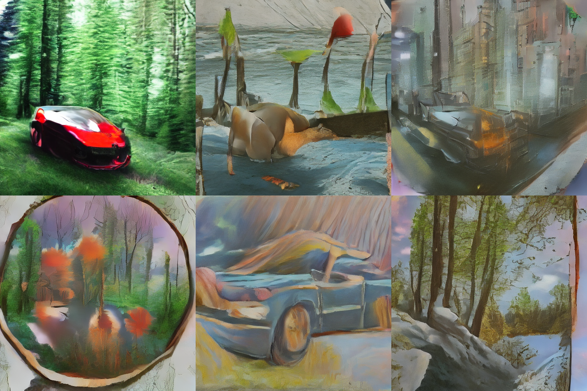

<p align="center">
  
  <em>Sample outputs at epoch 42 — 232K steps on 2× RTX 5090</em>
</p>

# Stable Diffusion from Scratch

[](https://github.com/atandra2000/StableDiffusion)
[](https://huggingface.co/atandra2000/sd-from-scratch-v1)
[](LICENSE)
[](https://www.python.org/)
[](https://wandb.ai/atandrabharati-self/stable-diffusion)

A full-stack Stable Diffusion 1.x-class latent diffusion model — **built entirely from scratch in PyTorch, trained on 2× RTX 5090 (Blackwell) GPUs.** Every component (UNet, DDPM/DDIM, VAE pipeline, CLIP conditioning, data pipeline, DDP training loop) is hand-implemented; no `diffusers`, no `compel`, no black boxes.

**Checkpoint** → [atandra2000/sd-from-scratch-v1](https://huggingface.co/atandra2000/sd-from-scratch-v1) (12.5 GB, sd_epoch_042.pt)

---

## Quick Start

```bash
# 1. Download the checkpoint
pip install huggingface_hub
python scripts/download_checkpoint.py

# 2. Run inference
pip install torch torchvision transformers Pillow
python src/inference.py --prompt "a cinematic shot of a mountain lake at sunset" --checkpoint checkpoints/sd_epoch_042.pt
```

See [docs/inference.md](docs/inference.md) for advanced usage (negative prompts, batch mode, DDIM parameters).

---

## Repository Layout

```
├── src/                      # Core implementation
│   ├── model.py              # UNet (~860M params), DDPM/DDIM schedulers
│   ├── train.py              # DDP + BF16 training loop
│   ├── inference.py          # Apple Silicon + CUDA inference
│   ├── encode_latents.py     # VAE pre-encoding for training
│   ├── encode_pipeline.py    # Data-parallel latent encoder (2-GPU)
│   ├── generate.py           # Programmatic generation API
│   ├── SD_ImageGen.py        # Alternative inference script (CLI)
│   ├── SD_Model.py           # Legacy model (kept for reproducibility)
│   └── SD_Train.py / SD_Train_v2.py  # Legacy training scripts
├── data_pipeline/            # LAION-2B data processing
│   ├── 01_download_metadata.py → 06_filter_dataset.py
├── configs/
│   └── config.py             # Dataclass-based configuration
├── tests/                    # CPU smoke tests
│   ├── test_unet_forward.py
│   └── test_ddim_step.py
├── docs/                     # Documentation
│   ├── architecture.md       # Model architecture deep-dive
│   ├── training-loop.md      # Training procedure
│   ├── data-pipeline.md      # Data pipeline walkthrough
│   ├── inference.md          # Inference guide
│   ├── blog_post.md          # Medium-style write-up
│   └── images/               # Diagrams and samples
├── scripts/
│   └── download_checkpoint.py
├── results/samples/          # Curated output samples
├── assets/                   # Architecture diagram, plots
├── requirements.txt
├── LICENSE                   # MIT
├── CITATION.cff              # Citation metadata
└── .env.example              # Environment variable template
```

---

## Architecture

```
TEXT PROMPT
    │
    ▼
┌──────────────────────────────────┐
│  CLIP Text Encoder (frozen)      │  openai/clip-vit-large-patch14
│  77 tokens → (B, 77, 768)        │  123M params — no gradient
└──────────────────┬───────────────┘
                   │  context (B, 77, 768)
                   │
IMAGE              │
    │              │
    ▼              │
┌──────────────────────────────────┐
│  VAE Encoder (frozen)            │  stabilityai/sd-vae-ft-mse
│  (B,3,512,512) → (B,4,64,64)     │  83M params — no gradient
└──────────────────┬───────────────┘
                   │  latent z
                   ▼
           ┌───────────────┐
           │  add_noise(z,t)│  DDPM forward: z_t = √ᾱ_t·z + √(1-ᾱ_t)·ε
           └───────┬───────┘
                   │  (B, 4, 64, 64)  noisy latent
                   ▼
┌──────────────────────────────────┐
│  UNet Denoising Model            │  ~860M params — TRAINABLE
│                                  │
│  Encoder:                        │
│    Stage 0 (64×64):  320 ch      │  — no attention
│    Stage 1 (32×32):  640 ch      │  ← SpatialTransformer (cross-attn)
│    Stage 2 (16×16): 1280 ch      │  ← SpatialTransformer (cross-attn)
│    Stage 3  (8×8):  1280 ch      │  ← SpatialTransformer (cross-attn)
│  Bottleneck (8×8):  1280 ch      │  ← attn + resblock
│  Decoder:                        │
│    Stage 3  (8×8):  1280 ch      │  ← SpatialTransformer (cross-attn)
│    Stage 2 (16×16): 1280 ch      │  ← SpatialTransformer (cross-attn)
│    Stage 1 (32×32):  640 ch      │  ← SpatialTransformer (cross-attn)
│    Stage 0 (64×64):  320 ch      │  — no attention
│                                  │
│  ε_θ(z_t, t, ctx) → (B, 4, 64, 64)
└──────────────────┬───────────────┘
                   │  predicted noise ε̂
                   │
            MSE Loss: ||ε̂ − ε||²
                   │
              ▽ (backprop)
```

For a detailed architectural walkthrough, see [docs/architecture.md](docs/architecture.md).

---

## Training Summary

| Stage | Epochs | Steps | Best Loss | LR | Notes |
|-------|--------|-------|-----------|----|-------|
| **Pre-training** | 1–10 | 136K | **0.1247** | 1e-4 → 1e-5 | Cosine decay, Min-SNR γ=5→2.5 |
| **Fine-tuning** | 11–42 | 96K | **0.0947** (ep 16) | 1e-5 | EMA decay=0.9999, CFG dropout=0.05 |
| **Final** | 42 | 232K | 0.1212 | — | Released checkpoint |

- **Hardware:** 2× RTX 5090 (Blackwell, cc 10.x, 32 GB VRAM each) on RunPod
- **Dataset:** LAION-2B-en-aesthetic (~12M images, filtered to aesthetic ≥ 6.5)
- **Multi-GPU:** DDP (NCCL) with BF16 autocast, gradient accumulation (effective batch 96)
- **Loss:** Min-SNR-weighted MSE (γ=5.0 → 2.5 for fine-tuning)
- **EMA:** Polyak decay 0.9999, shadow weights stored in checkpoint

Full loss curves and per-epoch breakdown: [summary.md](summary.md)

---

## Checkpoints

| Download source | Size | Format | Notes |
|---|---|---|---|
| [Hugging Face Hub](https://huggingface.co/atandra2000/sd-from-scratch-v1) | 12.5 GB | PyTorch `.pt` | Contains `ema_state_dict` + `unet_state_dict`, optimizer, LR scheduler |
| GitHub Releases | — | — | Coming in v1.1 |

### Loading from Python

```python
import torch
from src.model import UNetModel, DDIMScheduler
from huggingface_hub import hf_hub_download

checkpoint = hf_hub_download(
    repo_id="atandra2000/sd-from-scratch-v1",
    filename="sd_epoch_042.pt",
)

ckpt = torch.load(checkpoint, map_location="cpu", weights_only=False)
unet_sd = ckpt["unet_state_dict"]

unet = UNetModel(in_ch=4, out_ch=4, ch=320, res_blks=2,
                 attn_lvls=(1, 2, 3), ch_mults=(1, 2, 4, 4),
                 heads=8, ctx_dim=768)
unet.load_state_dict(unet_sd, strict=True)
```

---

## Training Reproduction

### Data Pipeline

```bash
# The full pipeline from raw LAION metadata → encoded latents:
python data_pipeline/01_download_metadata.py
python data_pipeline/02_filter_metadata.py           # aesthetic ≥ 6.5
python data_pipeline/03_download_images.py            # WebDataset shards
python data_pipeline/04_preprocess_to_cache.py        # tokenize + augment
python data_pipeline/05_build_hf_dataset.py           # HuggingFace Dataset
python src/encode_latents.py                          # VAE encode to .npy
python src/encode_pipeline.py                         # 2-GPU parallel encode
```

See [docs/data-pipeline.md](docs/data-pipeline.md) for the complete walkthrough.

### Training

```bash
# Single node, 2× GPU (torchrun)
torchrun --nproc_per_node=2 src/train.py \
  --cache_path laion_hf_dataset/train \
  --latent_dir laion_latents \
  --epochs 42 \
  --batch_size 24 \
  --lr 1e-5 \
  --min_snr --min_snr_gamma 5.0 \
  --cfg_dropout 0.05 \
  --grad_ckpt \
  --memory_format channels_last

# Resume from checkpoint
torchrun --nproc_per_node=2 src/train.py \
  --resume checkpoints/sd_epoch_021.pt
```

---

## Inference

### CLI

```bash
# Single prompt (Apple Silicon or CUDA)
python src/inference.py \
  --prompt "a cosmic nebula with vibrant purples and blues" \
  --checkpoint checkpoints/sd_epoch_042.pt \
  --steps 50 --guidance 7.5 --seed 42

# With negative prompt
python src/inference.py \
  --prompt "a portrait of a woman" \
  --negative "blurry, low quality, deformed hands" \
  --checkpoint checkpoints/sd_epoch_042.pt

# Batch mode
python src/inference.py \
  --batch prompts.txt \
  --output_dir ./outputs \
  --checkpoint checkpoints/sd_epoch_042.pt
```

### Python API

```python
from src.generate import generate_images

images = generate_images(
    prompts=["a beautiful sunset over mountains"],
    checkpoint_path="checkpoints/sd_epoch_042.pt",
    num_steps=50,
    guidance_scale=7.5,
    seed=42,
)
images[0].save("output.png")
```

See [docs/inference.md](docs/inference.md) for all options.

---

## Known Differences from Official Stable Diffusion

| Component | Implementation | Diffuser Reference |
|---|---|---|
| UNet | Full ~860M param SD 1.x UNet, custom `SpatialTransformer`, Flash SDP | `UNet2DConditionModel` |
| Scheduler (training) | DDPM with `scaled_linear` beta schedule | `DDPMScheduler` |
| Scheduler (inference) | DDIM with optional stochastic (eta) | `DDIMScheduler` |
| Text encoder | `CLIPTextModel` from transformers (frozen) | `CLIPTextModel` |
| VAE | `AutoencoderKL` from diffusers (frozen) | `AutoencoderKL` |
| Conditioning | Classifier-Free Guidance with `--negative` prompt | CFG |
| Multi-GPU | DDP (NCCL) with BF16 autocast | `accelerate` |
| Loss | Min-SNR-weighted MSE | — |

---

## Citation

```bibtex
@software{bharati2026sdfromscratch,
  author = {Atandra Bharati},
  title = {{SD-From-Scratch v1}: A Stable-Diffusion-class Latent Diffusion Model
           Trained from Scratch on Dual {RTX} 5090s},
  year = {2026},
  url = {https://huggingface.co/atandra2000/sd-from-scratch-v1},
}
```

---

## License

MIT — see [LICENSE](LICENSE) for details.
