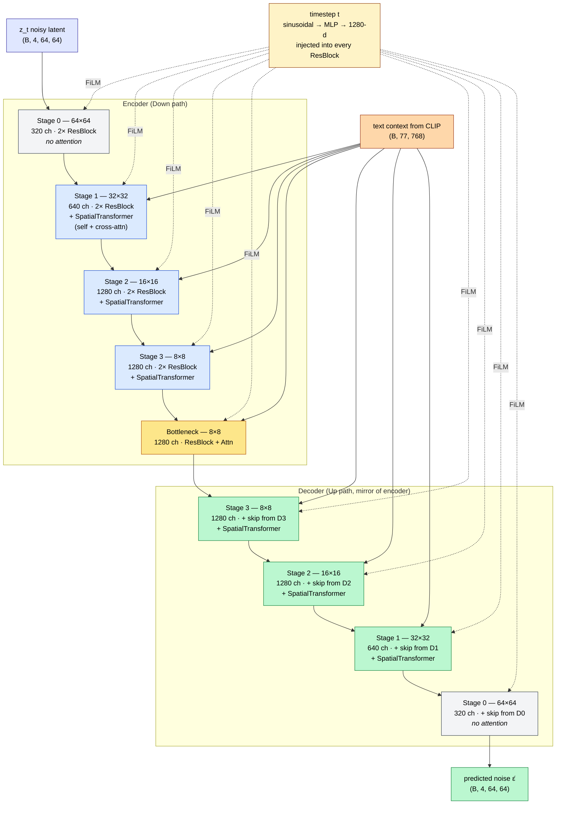
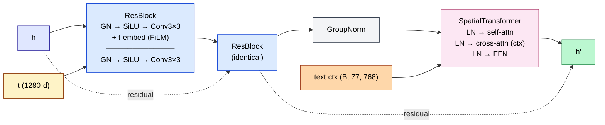

# Model Architecture

## Overview

The model implements the full latent diffusion pipeline from Rombach et al. (2022), composed of four learned components and two schedulers.

## Components

### 1. VAE (Frozen) — `stabilityai/sd-vae-ft-mse`

- **Encoder:** Down-convolves 512×512 RGB images to 64×64 latents (4 channels)
- **Decoder:** Up-convolves latents back to 512×512 RGB
- **Scale factor:** 0.18215 (multiply latents by this before UNet, divide after)
- **Parameters:** ~83M, frozen during training
- **Integration:** Loaded from diffusers `AutoencoderKL` via `PretrainedVAE` wrapper in `model.py`

### 2. CLIP Text Encoder (Frozen) — `openai/clip-vit-large-patch14`

- **Input:** 77 BPE tokens (truncated/padded)
- **Output:** `(B, 77, 768)` hidden states
- **Parameters:** ~123M, frozen during training
- **Integration:** Loaded from transformers `CLIPTextModel` via `PretrainedCLIPTextEncoder` wrapper

### 3. UNet (Trainable) — ~860M Parameters

The denoising backbone is a U-Net with spatial self-attention and cross-attention for text conditioning:



#### Block internals: ResBlock + SpatialTransformer



#### Key implementation details:

#### Key implementation details:

- **SpatialTransformer:** GroupNorm → Conv 1×1 → multi-head self-attention → cross-attention (text as K,V) → Conv 1×1 → residual
- **ResNetBlock:** GroupNorm → SiLU → Conv 3×3 → GroupNorm → SiLU → dropout → Conv 3×3 + residual
- **Time conditioning:** Sinusoidal timestep embedding → MLP → added to each ResNetBlock (FiLM-style scale+shift)
- **Flash Attention:** Enabled via `torch.backends.cuda.enable_flash_sdp(True)` on Blackwell (cc ≥ 8.0)
- **Gradient checkpointing:** Saves ~40% activation memory by recomputing activations during backward (configurable via `--grad_ckpt`)

### 4. DDPM Scheduler (Training)

Defines the forward noising process:

```
z_t = √(ᾱ_t) · z_0 + √(1 − ᾱ_t) · ε    where ε ~ N(0, I)
```

- **Beta schedule:** `scaled_linear` (β linearly spaced after square-root transformation)
- **Steps:** 1000
- **Range:** β₁ = 0.00085, β₁₀₀₀ = 0.012

### 5. DDIM Scheduler (Inference)

Deterministic reverse process (Song et al., 2020). Only 25–50 steps needed:

```
x̂_0     = (x_t − √(1−ᾱ_t) · ε_θ) / √(ᾱ_t)     (clean latent estimate)
x_{t−1} = √(ᾱ_{t−1}) · x̂_0 + √(1 − ᾱ_{t−1}) · ε_θ   (eta=0, deterministic)
```

**Note on `pred_x0.clamp(-1.0, 1.0)`:** The original 1000-step DDPM training code clamps the clean latent estimate to `[-1, 1]`. This is incorrect for inference — SD latents have a standard deviation of ~4, and clamping destroys signal quality. `model.py` now makes this clamp opt-in via `DDIMScheduler(clamp_pred_x0=False)` (default). The `inference.py` script and `SD_ImageGen.py` both set this to `False`.

## Parameter Count Breakdown

| Component | Parameters | Trainable |
|-----------|-----------|-----------|
| CLIP Text Encoder | 123M | ❌ |
| VAE (Encoder + Decoder) | 83M | ❌ |
| UNet | ~860M | ✅ |
| **Total pipeline** | **~1.07B** | **~860M** |

## Memory Format

The model uses `channels_last` memory format (NHWC) on CUDA for optimal convolution performance on Blackwell. For Apple Silicon (MPS) or AMD GPUs, pass `--memory_format contiguous` at the command line to disable this.
